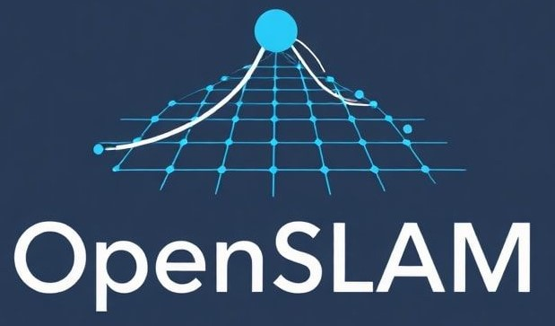

# OpenSLAM v2.0

<div align="center">



**Research-Grade SLAM Evaluation Platform**

[](LICENSE)
[](https://www.python.org/downloads/)
[](https://reactjs.org/)
[](https://fastapi.tiangolo.com/)

[Quick Start](#-quick-start) • [Features](#-features) • [Documentation](#-documentation) • [Structure](#-project-structure) • [Contributing](#-contributing)

</div>

---

## 🚀 Quick Start

```bash
./start_openslam.sh
```

**Access the application:**
- 🌐 Frontend: http://localhost:3001
- 📡 Backend API: http://localhost:8007
- 📖 API Docs: http://localhost:8007/docs

---

## 📖 Overview

OpenSLAM is a comprehensive SLAM evaluation platform that combines zero-code integration, modern web interface, and professional-grade evaluation tools. Designed for researchers and developers to quickly evaluate and compare SLAM algorithms without complex setup.

### 🎯 Key Highlights

- **⚡ Zero-Code Integration**: Add SLAM algorithms via YAML configuration - no coding required
- **🔌 Plugin System**: Flexible plugin architecture with Python, C++, and Docker support
- **📊 Real-Time Updates**: WebSocket-based live progress tracking
- **🎓 Multiple Formats**: KITTI, EuRoC, TUM RGB-D, ROS bags
- **⚙️ Docker Support**: Containerized SLAM execution
- **📈 Comprehensive Metrics**: ATE, RPE, robustness, alignment, and more

---

## ✨ Features

### 🗂️ Dataset Management

- **KITTI Format Support**: Load and validate KITTI datasets
- **Multi-Sensor Data**: Handle camera images, LiDAR point clouds, IMU data
- **Ground Truth Integration**: Automatic trajectory comparison
- **Directory Browser**: Easy dataset selection with file system navigation
- **Frame Preview**: Visualize dataset frames before processing

### ⚡ Algorithm Development

- **Plugin System**: Standardized interface for algorithm integration
- **Zero-Code YAML**: Configure algorithms without writing code
- **Python & C++ Support**: Multiple language bindings
- **Docker Integration**: Containerized algorithm execution
- **Real-Time Feedback**: Live execution progress and status updates

### 📊 Visualization

- **3D Trajectory Rendering**: Interactive camera path visualization
- **Point Cloud Display**: Real-time LiDAR data rendering
- **Ground Truth Overlay**: Compare estimated vs. actual trajectories
- **Multi-Camera View**: Simultaneous display of multiple camera feeds
- **Frame-by-Frame Playback**: Step through dataset sequences

### 🔬 Performance Analysis

- **Standard Metrics**: ATE (Absolute Trajectory Error), RPE (Relative Pose Error)
- **Algorithm Comparison**: Side-by-side performance evaluation
- **Statistical Analysis**: Detailed metric breakdowns
- **Export Capabilities**: Save results as CSV/JSON
- **Visual Reports**: Automatic plot generation

### 🔧 Supported Algorithms

- **ORB-SLAM3**: Feature-based visual SLAM
- **VINS-Mono**: Monocular visual-inertial SLAM
- **LIO-SAM**: LiDAR-inertial odometry
- **RTABMap**: RGB-D graph-based SLAM
- **DSO**: Direct sparse odometry

---

## 🚀 Installation

### Prerequisites

- **Python**: 3.10 or higher
- **Node.js**: 16.0 or higher
- **npm**: 8.0 or higher
- **Docker** (optional): For containerized deployment

### Automated Setup (Recommended)

#### 1. Clone the Repository

```bash
git clone https://github.com/yourusername/OpenSLAM.git
cd OpenSLAM
```

#### 2. Run the Startup Script

```bash
./start_openslam.sh
```

This script will automatically:
- Create and activate a Python virtual environment
- Install all Python dependencies
- Install all Node.js dependencies
- Create required directories
- Start the FastAPI backend on port 8007
- Start the React frontend on port 3001

The system will be ready at:
- 🌐 **Frontend**: http://localhost:3001
- 📡 **Backend**: http://localhost:8007
- 📖 **API Docs**: http://localhost:8007/docs

### Manual Setup

If you prefer manual setup:

```bash
# 1. Setup Python environment
python3 -m venv venv
source venv/bin/activate
pip install -r requirements.txt

# 2. Setup frontend
cd frontend
npm install
cd ..

# 3. Start backend
python3 run_backend.py &

# 4. Start frontend
cd frontend && npm start
```

### Docker Deployment

```bash
# Build and run with Docker Compose
docker-compose up --build
```

Access the application at:

- **Frontend**: http://localhost:3000
- **Backend API**: http://localhost:8000
- **API Documentation**: http://localhost:8000/docs

---

## 📚 Usage

### Loading a Dataset

1. Navigate to the **Datasets** page
2. Click **"📁 Browse Directories"**
3. Navigate to your KITTI dataset folder
4. Click **"Select This Directory"**
5. Click **"Load Dataset"**

The platform will automatically validate the dataset structure and load calibration data.

### Running SLAM Algorithms

**Via Web Interface:**
1. Go to the **Algorithms** page
2. Select a SLAM algorithm from the library
3. Choose a loaded dataset
4. Configure algorithm parameters
5. Click **"Execute"** to start evaluation
6. Monitor progress in real-time via WebSocket updates
7. View results in the **Visualization** and **Analysis** tabs

**Via Zero-Code YAML:**
1. Create a workflow configuration (see `examples/`)
2. Define dataset, algorithm, and evaluation settings
3. Run: `python openslam.py run-workflow my_config.yaml`
4. Results saved automatically to `results/`

### Comparing Algorithms

1. Execute multiple algorithms on the same dataset
2. Navigate to the **Analysis** page
3. Select algorithms to compare
4. View side-by-side metrics and plots
5. Export results as CSV/JSON for further analysis

---

## 🏗️ Project Structure

```
OpenSLAM/
├── frontend/              # React 18 frontend application
│   ├── src/
│   │   ├── components/    # React components
│   │   ├── App.js         # Main application
│   │   └── index.js       # Entry point
│   ├── public/            # Static assets
│   └── package.json       # Node.js dependencies
│
├── backend/               # FastAPI backend server
│   └── api/
│       └── main.py        # Main FastAPI application (800+ lines)
│
├── core/                  # Core SLAM evaluation modules
│   ├── plugin_manager.py  # Plugin discovery & validation
│   ├── plugin_executor.py # SLAM execution engine
│   ├── connector_engine.py # Zero-code transformations
│   ├── workflow_executor.py # Multi-stage workflows
│   ├── docker_orchestrator.py # Container execution
│   ├── dataset_loader.py  # Multi-format dataset support
│   ├── trajectory.py      # Trajectory processing
│   ├── metrics.py         # ATE, RPE, and advanced metrics
│   ├── visualization.py   # 2D/3D plotting
│   └── alignment.py       # SE3/Sim3 alignment
│
├── algorithms/            # SLAM algorithm implementations
│   ├── orb_slam3/
│   ├── vins_mono/
│   ├── liosam/
│   ├── rtabmap/
│   └── dso/
│
├── plugins/               # Additional SLAM plugins
├── connectors/            # Zero-code data transformations
│
├── docs/                  # Complete documentation
│   ├── SYSTEM_README.md   # Architecture overview
│   ├── API_README.md      # API reference
│   ├── PLUGIN_DEVELOPMENT_GUIDE.md
│   ├── ZERO_CODE_INTEGRATION.md
│   └── ... (14 documentation files)
│
├── examples/              # Example configurations
│   ├── plugin_template.yaml
│   ├── batch_config_example.yaml
│   └── slam_comparison.yaml
│
├── scripts/               # Utility scripts
│   ├── start_openslam.sh  # Main startup script
│   ├── quick_start.sh
│   └── run_server.sh
│
├── tests/                 # Test suite
│   ├── test_websocket.py
│   └── generate_test_data.py
│
├── config/                # Configuration files
│   ├── openslam_config.py
│   ├── plugin_config.py
│   └── docker_config.py
│
├── assets/                # Images and media
│   └── logo.jpg
│
├── data/                  # Dataset storage
├── results/               # Evaluation results
├── uploads/               # File uploads
├── cache/                 # Cache directory
├── temp/                  # Temporary files
├── logs/                  # Log files
│
├── others/                # Archived/backup code
│   ├── flask_api_backup/  # Previous Flask implementation
│   └── vanilla_js_scripts/ # Previous vanilla JS frontend
│
├── config.py              # Main configuration
├── openslam.py            # CLI tool
├── run_backend.py         # Backend launcher
├── requirements.txt       # Python dependencies
├── docker-compose.yml     # Docker configuration
└── README.md              # This file
```

### Technology Stack

**Frontend:**
- React 18 with React Router
- Plotly.js for 2D/3D visualization
- WebSocket for real-time updates
- Modern responsive UI/UX

**Backend:**
- FastAPI for high-performance REST API
- Pydantic for data validation
- NumPy for numerical computations
- OpenCV for image processing
- WebSocket for live progress tracking

**Core:**
- Plugin architecture for SLAM integration
- Docker support for containerized execution
- Multi-format dataset support (KITTI, EuRoC, TUM, ROS bags)
- Zero-code YAML workflows

---

## 🔌 API Documentation

Once the backend is running, visit `http://localhost:8007/docs` for interactive API documentation powered by Swagger UI.

### Key Endpoints

**Datasets:**

- `GET /api/datasets` - List all datasets
- `POST /api/datasets/load` - Load a new dataset
- `GET /api/datasets/{id}/details` - Get dataset details
- `POST /api/browse-directory` - Browse file system

**Algorithms:**

- `GET /api/algorithms/library` - List available algorithms
- `POST /api/algorithms/{id}/load` - Load algorithm plugin
- `POST /api/execute-algorithm` - Run algorithm

**Analysis:**

- `POST /api/analysis/compare` - Compare algorithms
- `GET /api/analysis/plots/{id}` - Get comparison plots

**WebSocket:**

- `WS /ws` - Main WebSocket connection
- `WS /ws/terminal` - Terminal I/O
- `WS /ws/execution` - Algorithm execution updates

---

## 🧩 Creating Custom Algorithms

### Plugin Structure

See `docs/PLUGIN_DEVELOPMENT_GUIDE.md` for detailed plugin development instructions.

**Basic structure:**

```
algorithms/my_algorithm/
├── config.yaml           # Algorithm metadata
├── launcher.py           # Entry point
├── algorithm.py          # Implementation
├── README.md            # Documentation
└── requirements.txt     # Dependencies (optional)
```

**Example templates** are available in the `examples/` directory:
- `examples/plugin_template.yaml` - YAML plugin configuration
- `examples/batch_config_example.yaml` - Batch evaluation setup
- `examples/slam_comparison.yaml` - Multi-algorithm comparison

### Quick Plugin Example

```yaml
# config.yaml
name: "My SLAM Algorithm"
category: "Visual SLAM"
description: "Description of your algorithm"
author: "Your Name"
version: "1.0.0"
sensors: ["camera", "imu"]
parameters:
  feature_threshold: 0.01
  max_features: 1000
```

```python
# launcher.py
import numpy as np

class MyAlgorithm:
    def initialize(self, config):
        # Initialize your algorithm
        return True

    def process_frame(self, frame_data):
        # Process a single frame
        return {
            "pose": np.eye(4),
            "features": []
        }

    def get_trajectory(self):
        # Return full trajectory
        return self.trajectory

    def finalize(self):
        # Cleanup
        pass
```

For more details, see:
- `docs/PLUGIN_DEVELOPMENT_GUIDE.md` - Complete plugin development guide
- `docs/ZERO_CODE_INTEGRATION.md` - Zero-code YAML integration
- `docs/CPP_INTEGRATION_GUIDE.md` - C++ plugin integration

---

## 🧪 Testing

```bash
# Run test suite
cd tests
python test_websocket.py
python generate_test_data.py

# Frontend tests
cd frontend
npm test

# Manual testing
# 1. Start the system: ./start_openslam.sh
# 2. Access frontend: http://localhost:3001
# 3. Check API docs: http://localhost:8007/docs
```

---

## 📊 Performance

- **Dataset Loading**: < 2 seconds for KITTI sequences
- **Frame Processing**: 30-60 FPS depending on algorithm
- **Visualization**: 60 FPS for trajectories, 30 FPS for point clouds
- **WebSocket Latency**: < 50ms for real-time updates

---

## 🛠️ Configuration

### Environment Variables

```bash
# Data directory
export OPENSLAM_DATA_DIR=/path/to/datasets

# Log directory
export OPENSLAM_LOG_DIR=/path/to/logs

# Temporary files
export OPENSLAM_TEMP_DIR=/path/to/temp

# Backend port
export OPENSLAM_BACKEND_PORT=8007

# Frontend port
export OPENSLAM_FRONTEND_PORT=3001
```

### Configuration Files

**Main configuration** (`config.py`):
- Directory paths (data, logs, temp, uploads, results, cache)
- Server ports (backend: 8007, frontend: 3001)
- Dataset formats and sensor types
- Metrics and visualization settings

**Additional configs** (in `config/` directory):
- `config/openslam_config.py` - OpenSLAM settings
- `config/plugin_config.py` - Plugin system settings
- `config/docker_config.py` - Docker orchestration settings

See `docs/SYSTEM_README.md` for detailed configuration options.

---

## 🐛 Troubleshooting

### Backend won't start

```bash
# Check Python version
python --version  # Should be 3.10+

# Install dependencies
pip install -r requirements.txt

# Check port availability
lsof -i :8007
```

### Frontend won't start

```bash
# Check Node.js version
node --version  # Should be 16.0+

# Clear cache and reinstall
cd frontend
rm -rf node_modules package-lock.json
npm install

# Check port availability
lsof -i :3001

# Check logs
tail -f logs/frontend.log
```

### Dataset loading fails

- Ensure dataset follows KITTI format
- Check file permissions
- Verify `calib.txt` and `times.txt` exist
- Check console for detailed error messages

---

## 🤝 Contributing

We welcome contributions! Please follow these steps:

1. Fork the repository
2. Create a feature branch (`git checkout -b feature/amazing-feature`)
3. Commit your changes (`git commit -m 'Add amazing feature'`)
4. Push to the branch (`git push origin feature/amazing-feature`)
5. Open a Pull Request

### Development Guidelines

- Follow PEP 8 for Python code
- Use ESLint for JavaScript code
- Write tests for new features
- Update documentation
- Add comments for complex logic

---

## 📝 License

This project is licensed under the MIT License - see the [LICENSE](LICENSE) file for details.

---

## 🙏 Acknowledgments

- **KITTI Dataset**: For providing benchmark datasets
- **ORB-SLAM3**: Carlos Campos et al.
- **VINS-Mono**: Tong Qin et al.
- **FastAPI**: Sebastián Ramírez
- **React**: Facebook Open Source

---

## 📧 Contact

- **Project Maintainer**: [Your Name]
- **Email**: your.email@example.com
- **GitHub**: [@yourusername](https://github.com/yourusername)
- **Issues**: [GitHub Issues](https://github.com/yourusername/OpenSLAM/issues)

---

## 🗺️ Roadmap

### v2.0 (Current) ✅

- [x] Zero-code YAML integration
- [x] Plugin architecture with Python/C++/Docker support
- [x] Multi-dataset format support (KITTI, EuRoC, TUM RGB-D, ROS bags)
- [x] FastAPI backend with WebSocket support
- [x] React 18 frontend with real-time updates
- [x] Comprehensive documentation in `docs/`
- [x] Clean project structure and organization

### v2.1 (Planned)

- [ ] Enhanced 3D visualization
- [ ] Real-time algorithm debugging
- [ ] Parameter tuning interface
- [ ] Web-based dataset browser
- [ ] Automated benchmark reporting

### v3.0 (Future)

- [ ] User authentication and authorization
- [ ] Multi-user collaboration
- [ ] Cloud dataset storage
- [ ] Advanced machine learning integration
- [ ] Mobile app support

---

## 📈 Project Status

**Current Version**: 2.0.0
**Status**: Active Development
**Last Updated**: November 2025

---

## 📚 Documentation

For detailed documentation, see the `docs/` directory:

- **`docs/SYSTEM_README.md`** - Complete architecture overview
- **`docs/API_README.md`** - API reference and endpoints
- **`docs/PLUGIN_DEVELOPMENT_GUIDE.md`** - Plugin development guide
- **`docs/ZERO_CODE_INTEGRATION.md`** - Zero-code YAML workflows
- **`docs/CPP_INTEGRATION_GUIDE.md`** - C++ plugin integration
- **`docs/SLAM_INTEGRATION_COOKBOOK.md`** - SLAM integration recipes

---

<div align="center">

**Made with ❤️ for the SLAM community**

[⬆ Back to Top](#openslam-v20)

</div>
