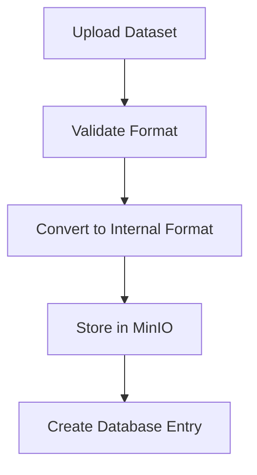
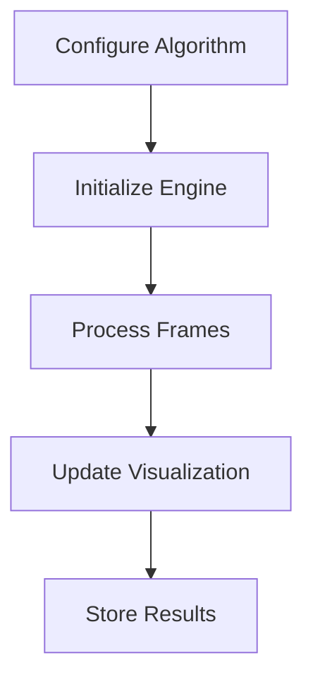

# OpenSLAM Platform 🤖 🗺️

<div align="center">

[](https://github.com/armanasq/openslam)
[](LICENSE)
[](https://www.python.org/downloads/)
[](https://reactjs.org/)
[](https://flask.palletsprojects.com/)

**OpenSLAM is an open-source platform democratizing Simultaneous Localization and Mapping (SLAM) research and development.**


[Features](#features) •
[Getting Started](#getting-started) •
[Documentation](#documentation) •
[Contributing](#contributing) •
[Roadmap](#roadmap)

*⚠️ OpenSLAM is currently under active development. First release expected Q4 2024. Star the repository to stay updated!*

</div>

---

## High-Level Architecture
```shell
┌─────────────────┐     ┌──────────────────┐     ┌─────────────────┐
│   React Client  │ ←→  │   Flask Server   │ ←→  │  SLAM Engine    │
│  (TypeScript)   │     │    (Python)      │     │   (Python)      │
└─────────────────┘     └──────────────────┘     └─────────────────┘
         ↑                       ↑                        ↑
         │                       │                        │
         │                       ↓                        ↓
         │              ┌──────────────────┐     ┌─────────────────┐
         └──────────→   │    PostgreSQL    │     │     MinIO       │
                        │    (Database)    │     │  (File Storage) │
                        └──────────────────┘     └─────────────────┘
```
## 🌟 Features

### Core Capabilities
- **Algorithm Development Framework**
  - Modular architecture for easy algorithm integration
  - Support for Visual SLAM, LiDAR SLAM, and Visual-Inertial SLAM
  - Comprehensive testing and benchmarking tools

- **Real-time Visualization**
  - Interactive 3D trajectory visualization
  - Point cloud rendering and manipulation
  - Real-time performance metrics

- **Dataset Integration**
  - Native KITTI dataset support
  - Custom dataset upload and management
  - Automated data preprocessing pipelines

### Technical Features
- **Frontend**
  - React-based responsive web interface
  - Real-time WebSocket data streaming
  - Interactive 3D visualizations using Three.js
  - TypeScript for enhanced type safety

- **Backend**
  - Flask-based RESTful API
  - Celery for distributed task processing
  - PostgreSQL for structured data storage
  - MinIO for large dataset handling

- **SLAM Engine**
  - Pure Python implementation
  - NumPy/SciPy optimization
  - CUDA acceleration support
  - Extensible algorithm interface
##

## Dataset Processing

## SLAM Execution



## 🚀 Getting Started

### Prerequisites
```bash
# System Requirements
Python 3.8+
Node.js 16+
PostgreSQL 13+
CUDA 11+ (optional, for GPU acceleration)

# Required Python packages
numpy>=1.21.0
scipy>=1.7.0
opencv-python>=4.5.0
pytorch>=1.9.0

# Frontend dependencies
node>=16.0.0
npm>=7.0.0
```

### Installation
```bash
# Clone repository
git clone https://github.com/armanasq/openslam.git
cd openslam

# Backend setup
python -m venv venv
source venv/bin/activate
pip install -r requirements.txt

# Frontend setup
cd frontend
npm install
```

### Quick Start
```bash
# Start backend server
cd backend
flask run

# Start frontend development server
cd frontend
npm start

# Access the platform
open http://localhost:3000
```

## 📚 Documentation

### Architecture Overview
```
openslam/
├── frontend/          # React frontend application
├── backend/           # Flask backend server
└── slam_engine/       # Core SLAM implementation
```

### Key Components
1. **Frontend Application**
   - User interface and visualization
   - Real-time data streaming
   - Configuration management

2. **Backend Server**
   - REST API endpoints
   - WebSocket server
   - Task queue management

3. **SLAM Engine**
   - Algorithm implementations
   - Optimization routines
   - Data processing pipelines

## 🤝 Contributing

We welcome contributions! Please read our [Contributing Guidelines](CONTRIBUTING.md) before submitting PRs.

### Development Setup
1. Fork the repository
2. Create a feature branch
3. Make  changes
4. Submit a pull request

### Code Standards
- Python: PEP 8
- TypeScript: ESLint configuration
- Documentation: Google style docstrings

## 📅 Roadmap

### Phase 1: Foundation (Q3 2024)
- [x] Core architecture design
- [x] Basic frontend implementation
- [x] Backend API structure
- [ ] Basic SLAM pipeline
- [ ] Initial documentation

### Phase 2: Core Features (Q4 2024)
- [ ] Visual SLAM implementation
- [ ] LiDAR SLAM integration
- [ ] Real-time visualization
- [ ] Dataset management

### Phase 3: Advanced Features (Q1 2025)
- [ ] Multi-sensor fusion
- [ ] Loop closure detection
- [ ] Performance optimization
- [ ] Community features

## 🛠️ Technical Details

### Supported Algorithms
- ORB-SLAM3
- VINS-Mono
- LOAM
- CartographerSLAM

### Performance Metrics
- Trajectory Accuracy
- Computational Efficiency
- Memory Usage
- Loop Closure Success Rate

### Integration Options
```python
# Python API Example
from openslam import SLAMEngine

engine = SLAMEngine(config={
    'algorithm': 'orb_slam3',
    'sensor_type': 'stereo'
})

results = engine.process_sequence(dataset_path)
```

## 📊 Benchmarks

*Detailed benchmarks will be available after first release*

## 🔒 Security

### Data Privacy
- End-to-end encryption for data transfer
- Secure dataset storage
- Access control mechanisms

### Authentication
- JWT-based authentication
- Role-based access control
- OAuth2 integration (planned)

## 📄 License

Copyright (c) 2024 OpenSLAM Team.

Licensed under the Apache License, Version 2.0. See [LICENSE](LICENSE) for details.

## 🙏 Acknowledgments

- KITTI Dataset Team
- Open-source SLAM community
- Research institutions and contributors

## 📬 Contact

- Project Lead: [Arman Asgharpoor](mailto:a.asgharpoor1993@gmail.com)
- Website: [openslam.ai](https://openslam.ai) (Coming Soon)

---

<div align="center">

**OpenSLAM is a community effort. Stars ⭐ and contributions are welcome!**

[Report Bug](https://github.com/armanasq/openslam/issues) •
[Request Feature](https://github.com/armanasq/openslam/issues) •

</div>
